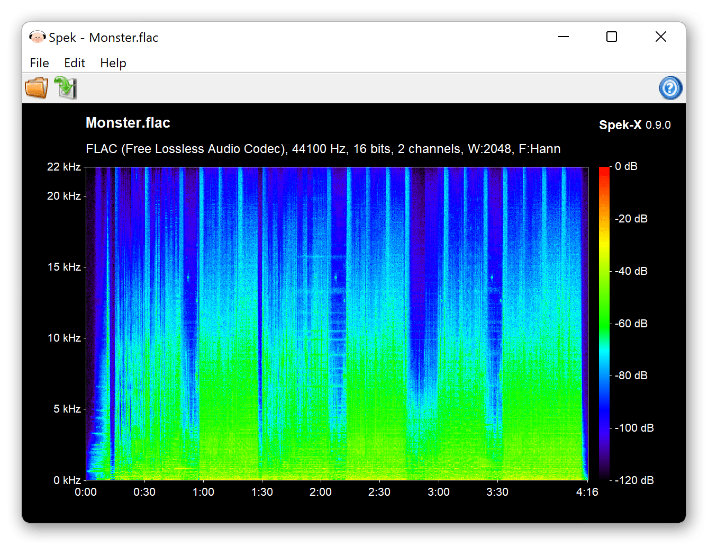

# Spek-X

[[英文 English]](./README.md)

Spek-X (IPA: /spɛks/) 是 [Spek-alternative](https://github.com/withmorten/spek-alternative) 的一个 fork 项目，它最初源自 [Spek](https://github.com/alexkay/spek)。

Spek 是一个用 C 和 C++ 编写的声学频谱分析器。它使用 FFmpeg 库进行音频解码，并使用 wxWidgets 构建图形用户界面。

Spek 可用于 *BSD、GNU/Linux、Windows 和 macOS.

在 Spek 的网站上获取更多相关信息： <http://spek.cc/>

## Spek-X 0.9.2 - 2023/1/27

### Sources / Packages

Category                             | Download link
-------------------------------------|----------------
源代码包                             | [v0.9.3.tar.gz](https://github.com/MikeWang000000/spek-X/archive/v0.9.3.tar.gz)
Windows (x64)                        | [spek-x-0.9.3-windows-x86_64.zip](https://github.com/MikeWang000000/spek-X/releases/download/v0.9.3/spek-x-0.9.3-windows-x86_64.zip)
Windows (Arm64)                      | [spek-x-0.9.3-windows-aarch64.zip](https://github.com/MikeWang000000/spek-X/releases/download/v0.9.3/spek-x-0.9.3-windows-aarch64.zip)
macOS (Intel)                        | [spek-x-0.9.3-macos-x86_64.tgz](https://github.com/MikeWang000000/spek-X/releases/download/v0.9.3/spek-x-0.9.3-macos-x86_64.tgz)
macOS (Apple Silicon)                | [spek-x-0.9.3-macos-aarch64.tgz](https://github.com/MikeWang000000/spek-X/releases/download/v0.9.3/spek-x-0.9.3-macos-aarch64.tgz)
Debian 软件包 (deb-multimedia.org)   | [spek-x-dmo/](https://deb-multimedia.org/pool/main/s/spek-x-dmo/)

### 新增功能和改进

Spek-X 0.9.3 更新：
 * FFmpeg 更新至 6.0。
 * 支持 32-bit FLAC 音频。

Spek-X 0.9.2 更新：
 * 支持切换声道。
 * 移除了 “检查更新” 功能。
 * 修复了潜在的内存泄漏。

Spek-X 0.9.1 更新：
 * 修复了 m4a 和 ogg 的解码问题。
 * 修复了一些崩溃问题。

Spek-X 0.9.0 更新（自 0.8.2 以来）：
 * 适用于 Apple Silicon 的程序现在可用了。
 * 适用于 Windows Arm64 的程序现在可用了。
 * FFmpeg 更新至 5.0+
 * wxWidgets 更新至 3.0+
 * 新增用于保存频谱图的命令行支持。
 * 新增高 DPI 屏幕支持，修复文字显示不全问题。
 * 新增 Windows MSYS2 的构建方法。
 * Windows 上现在使用单一 exe 文件。
 * 优化了简体中文、繁体中文和法语的翻译。
 * 抑制了 wxWidgets 的警告弹窗。
 * 优化了 Linux 上的文件关联。
 * 修复了一些导致崩溃的错误。

### 构建指南

[Windows](./dist/win/README-zh_CN.md) | [macOS](./dist/osx/README-zh_CN.md) | [Linux 和其他类 Unix 系统](./INSTALL-zh_CN.md#Linux-和其他类-Unix-系统)

### 依赖

 * wxWidgets >= 3.0
 * FFmpeg >= 5.0
